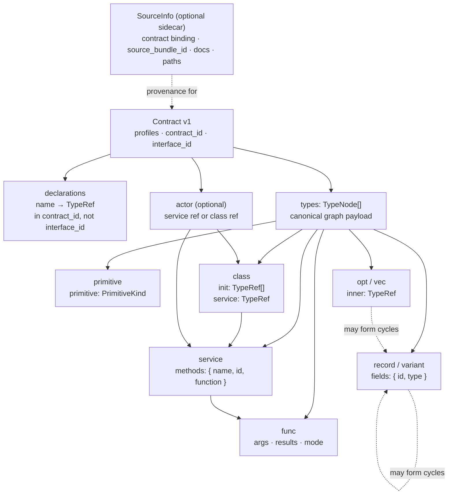

# Contract graph v1

The canonical Contract is an arena-backed directed graph.  Node references are
integers into `types`, so recursion is expressed by direct edges rather than
duplicating a type tree or resolving names at runtime.



## JSON vocabulary

The following is the implemented v1 shape. `from_json` validates and returns a
canonicalized Contract; canonicalization deterministically re-indexes the
arena and orders declaration, field, and method collections.

```ts
type U32 = number;
type TypeRef = U32;

type Contract = {
  format: "candid-core";
  format_version: 1;
  semantics_profile: "candid-1";
  canonicalization_profile: "candid-core-canon-1";
  identities: {
    contract: `candid-core:contract:v1:sha256:${string}`;
    interface?: `candid-core:interface:v1:sha256:${string}`;
  };
  producer: ProducerInfo;
  types: TypeNode[];
  declarations: Array<{ name: string; type: TypeRef }>;
  actor?:
    | { kind: "service"; service: TypeRef }
    | { kind: "class"; class: TypeRef };
};

type ProducerInfo = {
  name: string;
  version: string;
  // Exact linked Candid semantic engine crate selected by this package.
  candid_version: string;
  // Exact Candid parser front-end crate selected by this package.
  candid_parser_version: string;
};

type Field = { id: U32; type: TypeRef };
type Method = { name: string; id: U32; function: TypeRef };

type TypeNode =
  | { kind: "primitive"; primitive: PrimitiveKind }
  | { kind: "opt" | "vec"; inner: TypeRef }
  | { kind: "record" | "variant"; fields: Field[] }
  | { kind: "func"; args: TypeRef[]; results: TypeRef[]; mode: MethodMode }
  | { kind: "service"; methods: Method[] }
  | { kind: "class"; init: TypeRef[]; service: TypeRef };

type PrimitiveKind =
  | "null" | "bool" | "nat" | "int"
  | "nat8" | "nat16" | "nat32" | "nat64"
  | "int8" | "int16" | "int32" | "int64"
  | "float32" | "float64" | "text" | "reserved" | "empty" | "principal";

type MethodMode = "update" | "query" | "composite_query" | "oneway";
```

The optional sidecar is separately versioned and intentionally not part of the
Contract type above:

```ts
type SourceInfo = {
  source_info_version: 1;
  contract_id: `candid-core:contract:v1:sha256:${string}`;
  source_bundle_id: `candid-core:source-bundle:v1:sha256:${string}`;
  sources: Array<{ name: string; source: string }>;
  imports: Array<{
    from: string; import: string; to: string; kind: "type" | "service";
  }>;
  declarations: Array<{ source: string; name: string; type: TypeRef; docs?: string[] }>;
  field_labels: Array<{
    origin: SourceOrigin; path: string; container: TypeRef; id: U32;
    label: SourceLabel; docs?: string[];
  }>;
  methods: Array<{ origin: SourceOrigin; path: string; service: TypeRef; name: string; docs?: string[] }>;
  function_arguments: Array<{
    origin: SourceOrigin; path: string; function: TypeRef;
    direction: "argument" | "result"; position: U32; name: string;
  }>;
  actors: Array<{ source: string; docs?: string[] }>;
};
type SourceOrigin =
  | { kind: "declaration"; source: string; name: string }
  | { kind: "actor"; source: string };
type SourceLabel =
  | { kind: "named"; name: string }
  | { kind: "numeric" }
  | { kind: "positional" };
```

`actor` is omitted for a DID containing only declarations.  An empty actor is
different: it is a `service` node with an empty `methods` array and
`{ kind: "service", service: TypeRef }` selects that node.

## Wire IDs, names, and cycles

Record and variant fields contain only their authoritative Candid `u32` wire
ID. Service methods contain their source-visible `name`, its Candid method
`id`, and a ref to the `func` node. The semantic engine supplies field IDs;
the Contract validator also checks that every method ID is Candid's hash of its
name. Contract consumers do not reconstruct source labels.

SourceInfo separately preserves whether a field label was named, numeric, or
positional, along with its original spelling, documentation, origin, and an
AST-shaped occurrence path. Raw source bundles include all resolved imports.
This keeps wire identity separate from provenance even when equivalent nested
source types are interned to one Contract node.

The upstream public AST does not offer stable byte spans for all nodes. v1
therefore puts raw source plus paths in SourceInfo and retains byte spans on
parser diagnostics, rather than writing a second Candid parser to synthesize
spans.

Aliases produce declaration/provenance entries but never add an alias node to
the semantic type algebra.  For example, aliases that resolve to the same
underlying type can point at the same `TypeRef`.  The arena may also contain
the direct cycle needed for a recursive type:

```text
types[3] = { kind: "record", fields: [ { id: <hash(next)>, type: 4 } ] }
types[4] = { kind: "opt", inner: 3 }
```

Mutual recursion is represented the same way, with references crossing between
two or more nodes.

## Validation checklist

JSON decoding and graph validation reject a Contract when any of these are
false:

1. All profiles are supported; `contract_id` matches the complete canonical
   Contract and `interface_id` matches the actor-reachable graph. SourceInfo is
   independently bound by `contract_id` and `source_bundle_id`.
2. Every reference is an in-range integer and each constrained reference has
   the required node kind (`func`, `service`, etc.).
3. Field IDs and method IDs are Candid `u32` values. Aggregate field IDs and
   service method names are unique. Each method ID matches the Candid hash of
   its name; distinct method names may share that 32-bit hash.
4. Function mode is exactly one supported value: `update`, `query`,
   `composite_query`, or `oneway`; `oneway` has no result refs.
5. Declarations have valid names and refs; a class service ref targets a
   service node; actor shape agrees with its referenced node kind; and a class
   is valid only as the top-level `actor.kind = "class"` root.
6. Every node is reachable from an actor or declaration root (unless `types`
   is empty). Cycles are accepted; dangling refs, malformed JSON, and malformed
   graph structure are not.

## What is intentionally outside this graph

No raw source, source locations, comments, documentation, named/numeric/
positional label spellings, UI hints, form controls, defaults, validation
policy, workflow state, transport settings, or encoded values live here.
Optional `SourceInfo` is a separate, validated sidecar bound by `contract_id`
and independently identified by `source_bundle_id`.

Likewise, `blob`, `tuple`, and `Result` are interpretations that can be
derived later from `vec nat8`, positional records, and conventional variants.
They are never primitive Contract node kinds.
